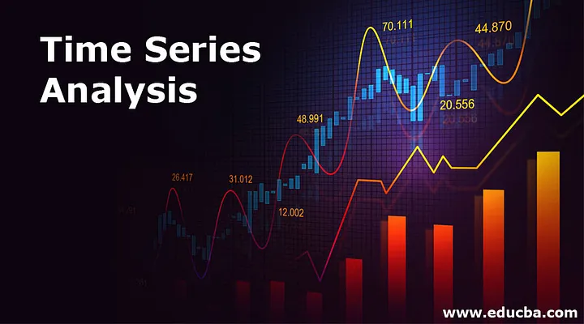
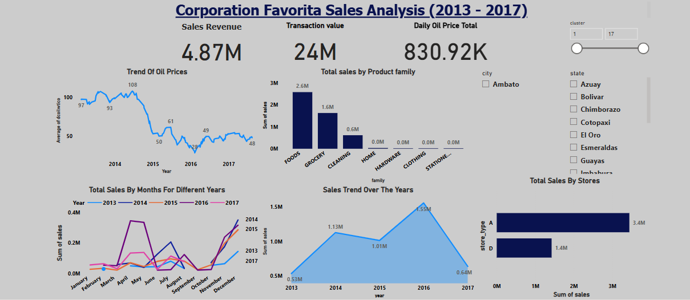

# Time-Series-Regression-Analysis-Corporation-Favorita

*Predictive Modeling for Store Sales at Corporation Favorita*

*Project Description*
Accurate sales forecasting is crucial for optimizing inventory, resource allocation, and strategic decision-making in the fast-paced retail sector. This project explores time series forecasting for store sales, with the goal of developing a reliable predictive model for Favorita, a prominent grocery retailer based in Ecuador. Utilizing data and advanced analytics, we aim to refine Favorita's operations, elevate customer satisfaction, and stimulate business growth.

*Business Understanding*
The primary goal of this project is to create a robust and precise time series forecasting model to predict store sales for various products across Favorita stores. By utilizing historical sales data and pertinent supplementary information, the model aims to deliver dependable forecasts, empowering Favorita to optimize inventory management, resource allocation, and marketing strategies. The successful deployment of this model will lead to enhanced operational efficiency, better decision-making, and increased profitability for the retailer.

 *Business Goals*
1. Increase operational efficiency by optimizing inventory management, reducing lead times, and increasing sales per customer.
2. Stimulate business growth by attracting new customers and increasing customer satisfaction.
3. Enhance marketing strategies by optimizing promotional and sales channels, and increasing customer loyalty.
Building a model to accurately predict sales at different favorita stores

 **Success Criteria**
- Achieve a 0.2 RMSE (Root Mean Squared Error) in sales forecasting models.
- Improve inventory management efficiency and reduce stockout instances.

 **Constraints and Assumptions**
- Assumption: Historical sales data is representative of future demand patterns.
- Constraint: Limited availability of real-time sales data for model training.

 **Data Requirements**
- Utilize data from train.csv, stores.csv, holidays_events.csv, oil.csv, and transaction.csv for analysis.
- Include features such as store_nbr, family, onpromotion, store metadata, oil prices, holidays, and transactional data.

*Hypothesis Statement*
Null Hypothesis (H0): The promotional activities have a significant impact on store sales for Corporation Favorita.

Alternative Hypothesis (H1): The promotional activities have a significant impact on store sales for Corporation Favorita.

*Analytical Questions*
1. Is the train dataset complete (has all the required dates)?
2. Which dates have the lowest and highest sales for each year (excluding days the store was closed)?
3. Compare the sales for each month across the years and determine which month of which year had the highest sales.
4. Did the earthquake impact sales?
5. Are certain stores or groups of stores selling more products? (Cluster, city, state, type)
6. Are sales affected by promotions, oil prices and holidays?
7. What analysis can we get from the date and its extractable features?
8. Which product family and stores did the promotions affect.
9. What is the difference between RMSLE, RMSE, MSE (or why is the MAE greater than all of them?)
10. Does the payment of wages in the public sector on the 15th and last days of the month influence the store sales.

*Data Understanding*
File Descriptions and Data Field Information

**train.csv**

- The training data, comprising time series of features store_nbr, family, and onpromotion as well as the target sales.

- store_nbr identifies the store at which the products are sold.

- family identifies the type of product sold.

- sales gives the total sales for a product family at a particular store at a given date. Fractional values are possible since products can be sold in fractional units (1.5 kg of cheese, for instance, as opposed to 1 bag of chips).

- onpromotion gives the total number of items in a product family that were being promoted at a store at a given date.

**test.csv**

- The test data, having the same features as the training data. You will predict the target sales for the dates in this file.

- The dates in the test data are for the 15 days after the last date in the training data.

**transaction.csv**

- Contains date, store_nbr and transaction made on that specific date.

**sample_submission.csv**

- A sample submission file in the correct format.

**stores.csv**

- Store metadata, including city, state, type, and cluster.

- cluster is a grouping of similar stores.

**oil.csv**

- Daily oil price which includes values during both the train and test data timeframes. (Ecuador is an oil-dependent country and its economical health is highly vulnerable to shocks in oil prices.)

###### 
**holidays_events.csv**
Holidays and Events, with metadata

NOTE: Pay special attention to the transferred column. A holiday that is transferred officially falls on that calendar day but was moved to another date by the government. A transferred day is more like a normal day than a holiday. To find the day that it was celebrated, look for the corresponding row where type is Transfer.

For example, the holiday Independencia de Guayaquil was transferred from 2012-10-09 to 2012-10-12, which means it was celebrated on 2012-10-12. Days that are type Bridge are extra days that are added to a holiday (e.g., to extend the break across a long weekend). These are frequently made up by the type Work Day which is a day not normally scheduled for work (e.g., Saturday) that is meant to payback the Bridge.

Additional holidays are days added a regular calendar holiday, for example, as typically happens around Christmas (making Christmas Eve a holiday).

**Additional Notes**

- Wages in the public sector are paid every two weeks on the 15th and on the last day of the month. Supermarket sales could be affected by this.

- A magnitude 7.8 earthquake struck Ecuador on April 16, 2016. People rallied in relief efforts donating water and other first need products which greatly affected supermarket sales for several weeks after the earthquake.

